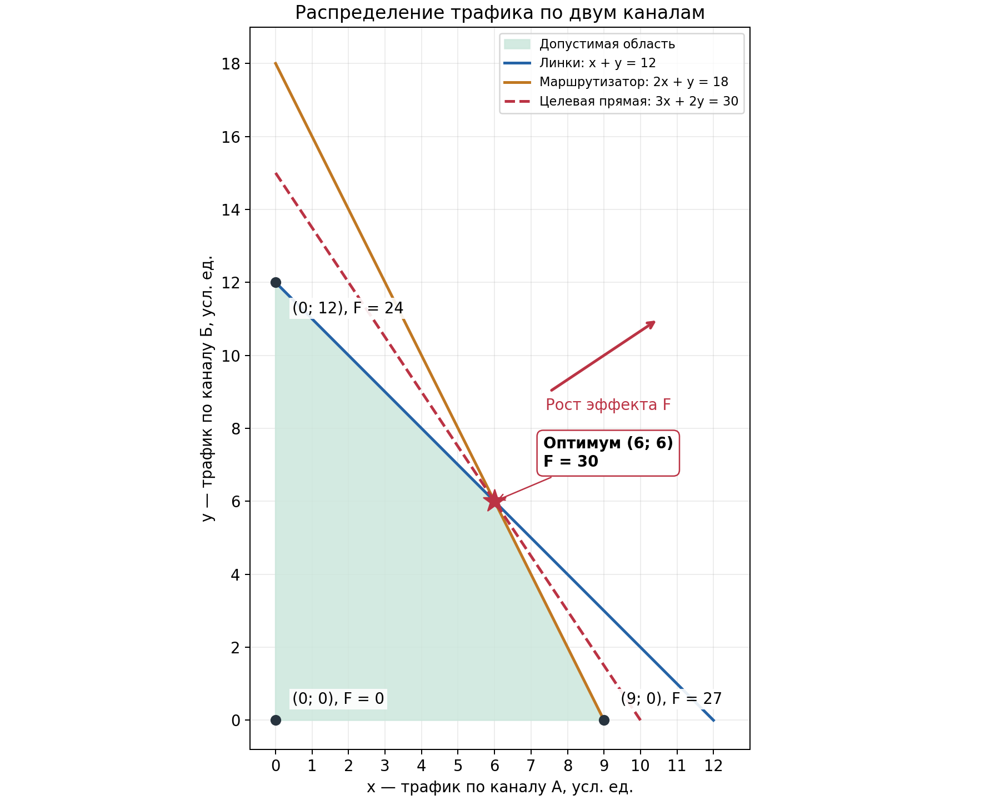

# Отчёт по практическому заданию № 1

**Дисциплина:** Методы оптимизации  
**Тема:** Оптимальное распределение трафика по двум каналам связи  
**Язык программирования:** Python

## 1. Постановка задачи

Трафик передаётся между двумя дата-центрами по каналам А и Б. Необходимо определить объём трафика по каждому каналу, максимизирующий суммарный полезный эффект при ограничениях на физические линки и промежуточный маршрутизатор.

| Показатель | На единицу трафика по А | На единицу трафика по Б | Допустимое суммарное значение |
|---|---:|---:|---:|
| Полезный эффект | 3 | 2 | Максимизируется |
| Нагрузка на физические линки | 1 | 1 | Не более 12 |
| Нагрузка на маршрутизатор | 2 | 1 | Не более 18 |

Все величины заданы в условных единицах. Требование целочисленности в условии отсутствует: объёмы трафика рассматриваются как неотрицательные действительные числа. Получившееся оптимальное решение также является целочисленным, но это результат расчёта, а не дополнительное ограничение модели.

## 2. Математическая модель

Введём переменные:

- $x$ — объём трафика по каналу А;
- $y$ — объём трафика по каналу Б.

Суммарный полезный эффект равен:

$$
F(x,y)=3x+2y.
$$

Нагрузка на физические линки равна сумме объёмов трафика. Нагрузка на маршрутизатор учитывает удвоенный расход ресурса для канала А. Модель имеет вид:

$$
\begin{aligned}
&\max F(x,y)=3x+2y,\\
&x+y\leq12,\\
&2x+y\leq18,\\
&x\geq0,\quad y\geq0.
\end{aligned}
$$

Задача относится к линейному программированию, поскольку целевая функция и ограничения линейны.

## 3. Выбор метода

Использован метод перебора вершин допустимой области с графической иллюстрацией. Он удобен для задачи с двумя переменными и небольшим количеством ограничений.

Допустимая область непуста: точка $(0,0)$ удовлетворяет всем ограничениям. Она ограничена: из неотрицательности и ограничения $x+y\leq12$ следует, что обе переменные не превышают 12. Область является замкнутым выпуклым многоугольником.

Линейная функция на таком многоугольнике достигает максимума хотя бы в одной вершине. Поэтому достаточно найти все вершины и сравнить значения целевой функции в них. В отдельных задачах оптимальным может быть целое ребро; проверка вершин всё равно позволяет найти максимальное значение. В рассматриваемой задаче оптимум единственный.

Это не перебор всех целых значений трафика и не симплекс-метод: программа перебирает пары граничных прямых. Дробные координаты также учитываются.

## 4. Аналитическое решение

### 4.1. Границы допустимой области

Граничные прямые двух ресурсных ограничений:

$$
x+y=12,\qquad 2x+y=18.
$$

Первая прямая пересекает оси в точках $(12,0)$ и $(0,12)$, вторая — в точках $(9,0)$ и $(0,18)$. Дополнительно учитываются границы неотрицательности: $x=0$ и $y=0$.

Точки $(12,0)$ и $(0,18)$ служат для построения прямых, но не являются допустимыми решениями:

- в $(12,0)$ нагрузка на маршрутизатор равна 24 при пределе 18;
- в $(0,18)$ нагрузка на линки равна 18 при пределе 12.

### 4.2. Пересечение ресурсных ограничений

Решим систему:

$$
\begin{cases}
x+y=12,\\
2x+y=18.
\end{cases}
$$

Вычитая первое уравнение из второго, получаем $x=6$. Тогда $y=12-6=6$.

Итак, вершины допустимой области: $(0,0)$, $(9,0)$, $(6,6)$ и $(0,12)$.

### 4.3. Сравнение вариантов

| Точка | Трафик по А | Трафик по Б | Нагрузка на линки | Нагрузка на маршрутизатор | Полезный эффект |
|---|---:|---:|---:|---:|---:|
| O | 0 | 0 | 0 | 0 | 0 |
| P | 9 | 0 | 9 | 18 | 27 |
| Q | 6 | 6 | 12 | 18 | **30** |
| R | 0 | 12 | 12 | 12 | 24 |

Максимальное значение достигается в точке $(6,6)$:

$$
F_{\max}=3\cdot6+2\cdot6=30.
$$

### 4.4. Проверка оптимальности

Сложим ресурсные ограничения:

$$
(x+y)+(2x+y)\leq12+18.
$$

Следовательно,

$$
F(x,y)=3x+2y\leq30.
$$

Ни одно допустимое решение не может дать эффект больше 30. Найденное решение достигает этой границы, следовательно, оно оптимально.

Для достижения равенства оба исходных ограничения должны выполняться как равенства: их неотрицательные остатки должны суммироваться в ноль. Соответствующая система имеет единственное решение $(6,6)$, что подтверждает единственность оптимума.

## 5. Визуализация



На рисунке:

- синяя прямая соответствует ограничению на линки;
- оранжевая прямая соответствует ограничению на маршрутизатор;
- зелёная область содержит все допустимые сочетания объёмов трафика;
- красная пунктирная прямая задаёт уровень целевой функции $3x+2y=30$;
- звёздочка отмечает оптимум $(6,6)$;
- стрелка показывает направление роста эффекта.

Все точки одной целевой прямой имеют одинаковый эффект. При параллельном перемещении этой прямой в направлении роста эффекта последней общей точкой с допустимой областью становится $(6,6)$. Дальнейшее перемещение приводит к нарушению хотя бы одного ограничения.

## 6. Программная реализация

### 6.1. Представление ограничений

В `main.py` каждое ограничение хранится в объекте `Constraint` в форме:

$$
a x+b y\leq d.
$$

Неотрицательность также приводится к этому виду:

$$
-x\leq0,\qquad -y\leq0.
$$

Благодаря этому все ограничения проверяются одинаковым способом.

### 6.2. Вычисление пересечений

Для каждой пары граничных прямых решается система:

$$
\begin{cases}
a_1x+b_1y=d_1,\\
a_2x+b_2y=d_2.
\end{cases}
$$

Определитель:

$$
\Delta=a_1b_2-a_2b_1.
$$

Если он не равен нулю, координаты находятся по формулам Крамера:

$$
x=\frac{d_1b_2-d_2b_1}{\Delta},\qquad
y=\frac{a_1d_2-a_2d_1}{\Delta}.
$$

Если определитель равен нулю, единственной точки пересечения нет: прямые параллельны или совпадают. Такая пара пропускается.

Вычисления выполняются через `fractions.Fraction`, поэтому рациональные координаты и проверки ограничений не зависят от погрешностей чисел с плавающей точкой. Преобразование в `float` используется только для построения рисунка.

### 6.3. Алгоритм

1. Сформировать четыре ограничения и коэффициенты целевой функции.
2. Перебрать все пары границ: для четырёх границ это шесть пар.
3. Найти точку пересечения каждой непараллельной пары.
4. Проверить точку по всем ограничениям.
5. Сохранить допустимые точки без повторов.
6. Вычислить полезный эффект в каждой вершине.
7. Выбрать вершину с наибольшим эффектом.
8. Вывести результат, проверить загрузку ресурсов, сохранить текст и график.

Координаты оптимума не подставляются в расчёт заранее: они вычисляются из коэффициентов ограничений.

### 6.4. Основные функции

| Функция | Назначение |
|---|---|
| `intersection()` | Найти пересечение двух границ |
| `is_feasible()` | Проверить выполнение всех ограничений |
| `objective()` | Вычислить полезный эффект |
| `find_vertices()` | Найти все допустимые вершины |
| `solve()` | Выбрать оптимальную вершину |
| `make_summary()` | Сформировать текстовый результат |
| `save_plot()` | Построить и сохранить график |
| `main()` | Обработать параметры запуска и сохранить результаты |

Для расчёта используется стандартная библиотека Python. Единственная внешняя зависимость — Matplotlib для визуализации. Режим `--no-plot` позволяет выполнить расчёт без неё.

Реализация предназначена для данного задания. Она не позиционируется как универсальный решатель произвольных задач ЛП: при изменении модели необходимо отдельно проверять непустоту и ограниченность области, а также обновлять график и текстовое доказательство.

## 7. Результаты и проверка

Программа получила:

```text
Трафик по каналу А: 6
Трафик по каналу Б: 6
Максимальный полезный эффект: 30
Физические линки: использовано 12 из 12; остаток 0
Маршрутизатор: использовано 18 из 18; остаток 0
```

При оптимальном распределении оба доступных ресурса используются полностью:

$$
6+6=12,\qquad 2\cdot6+6=18.
$$

Направление всего трафика только по каналу А даёт максимум 27, а только по каналу Б — 24. Совместное использование каналов позволяет получить больший эффект — 30.

Автоматические проверки находятся в `test_main.py` и запускаются командой:

```bash
python -m unittest -v
```

Проверяются:

1. Полный набор четырёх вершин.
2. Оптимальная точка, максимальный эффект и достижение верхней границы.
3. Отклонение точек, нарушающих каждое из четырёх ограничений.
4. Допустимость граничных и дробных точек.
5. Обработка параллельных и совпадающих прямых.
6. Точное вычисление дробного пересечения $(4/3,4/3)$ на отдельном примере.

Проверка выполнена на Python 3.12.14 с Matplotlib 3.10.8: все шесть тестов прошли. Дополнительно проверены обычный запуск с сохранением графика, расчёт без сторонних библиотек из другой рабочей папки и понятное сообщение при отсутствии Matplotlib. Готовый рисунок проверен визуально.

## 8. Вывод

Построена математическая модель распределения трафика и реализован поиск решения на Python. Оптимальное распределение составляет **6 единиц по каналу А и 6 единиц по каналу Б**. Максимальный полезный эффект равен **30 условным единицам**. Оба ограничения соблюдены, а оптимальность подтверждена сравнением вершин и независимой оценкой сверху.

